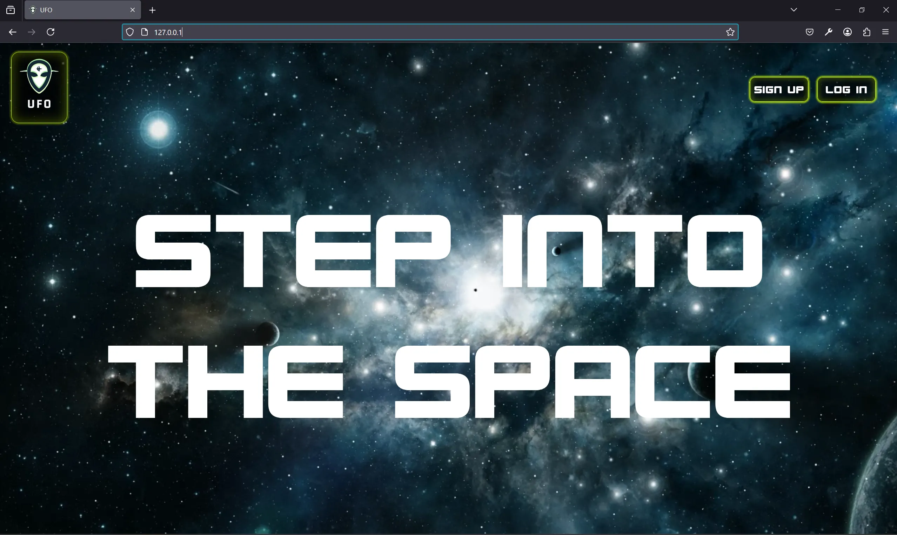
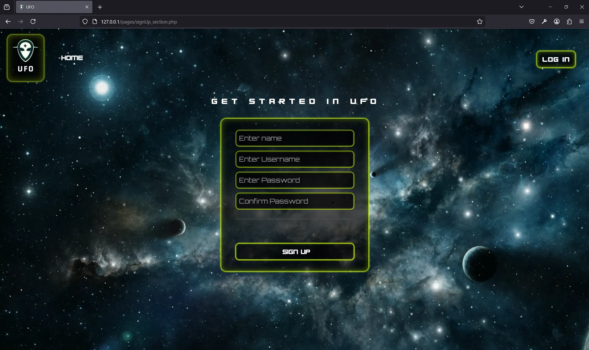
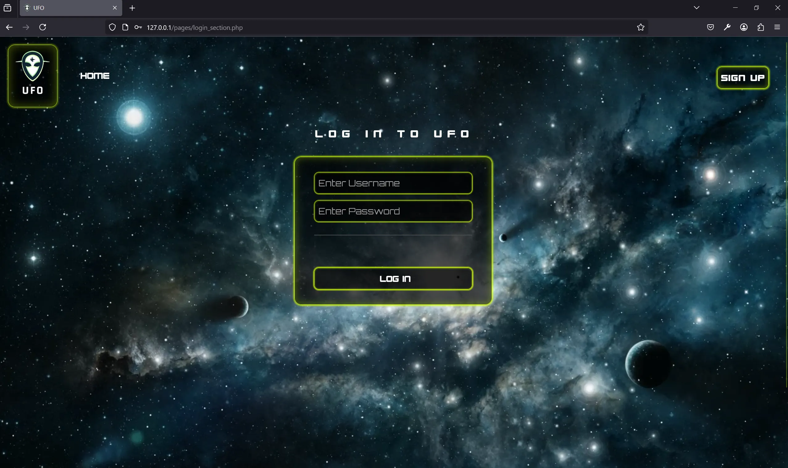
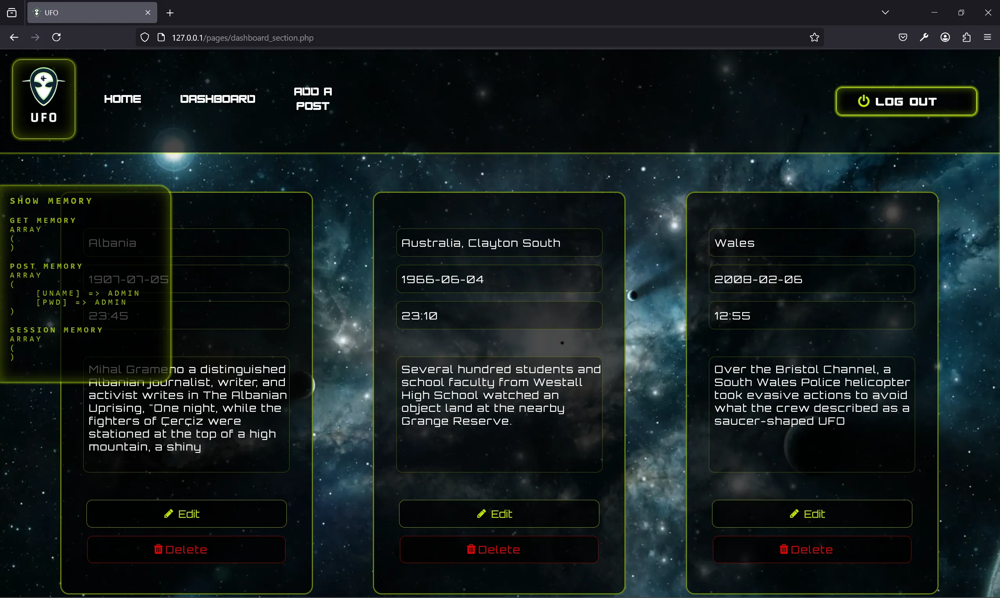
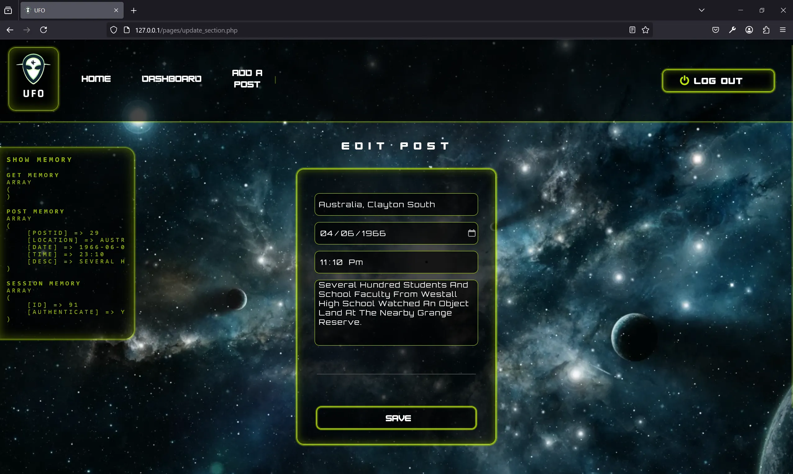

## 📄 Description

👽 This is a UFO theme web application designed for users interested in exploring and documenting UFO sightings. 
The site provides an intuitive navigation with a secure authentication system where users can create accounts and log in to access a private section of the website.
Once logged in, users can contribute by adding new posts detailing UFO sightings, complete with descriptions and relevant details.
In addition to creating posts, users have the ability to update their previously submitted sightings, ensuring the information remains accurate and up-to-date.
If necessary, users can also delete their posts, maintaining full control over their shared content. 🛸

* No frameworks
* No AI code
* Local content

The website is optimized for a 15.6" 1920 x 1080 display with a 16:9 aspect ratio.

## 🛢️ Database Connection

- User: <i>mri</i> 
- Password: <i>password</i>
- Host: <i>localhost</i>

🔑 LOGIN Credentials:

- User: <i>admin</i>
- Password: <i>admin</i>

## 📷 Screenshots

### index.php

### signUp_section.php

### login.php

### dashboard_section.php

### update_section.php

♦️ You will need a local server and import the database to display the website on your browser. 

## 📒 How to run a local server

You can use MAMP or XAMPP as free options:

https://www.mamp.info/en/windows/

https://www.apachefriends.org/

MAMP EXAMPLE (XAMPP works in the same way):

If you followed the default installation parameters, the directory to run the local server should be on this path: 

   C:\MAMP

Steps to start the server:

1. Start the server by running the <strong>MAMP.exe</strong> file. Next, initiate the Apache Server and MySQL Server if they don't do it automatically

2. At the same directory level where MAMP.exe is located, look for the <strong>htdocs</strong> folder and delete it.

3. Replace the removed <strong>htdocs</strong> folder for the one on this project.

4. In your browser type the following URL: 

   127.0.0.1:80/phpMyAdmin5/

5. Go to home and look for the <strong>User accounts</strong> tab on the top nav bar.

6. Click on <strong>Add user account</strong> and fill it with the following information: 

  - User name: <i>mri</i>
  - Host name: <i>localhost</i>
  - Password: <i>password</i>

7. Below, look for the <strong>global privileges</strong> label and set it to Check all.

8. On the right side nav bar look for New, and create a database with the same name as the SQL file. 

   In this case:  <i>ufo.sql</i>

9. Once it is done, go to the recently created database. Next, on the top nav bar look for the <strong>Import</strong> tab.

10. Browse the SQL file on your computer and click on <strong>Go</strong>.
  

